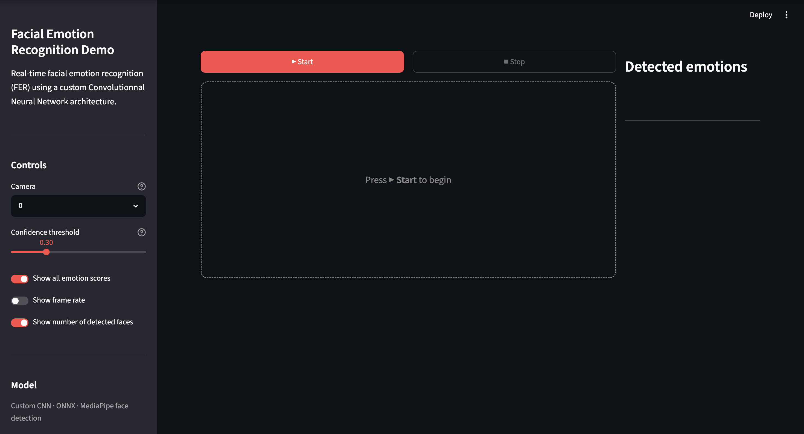
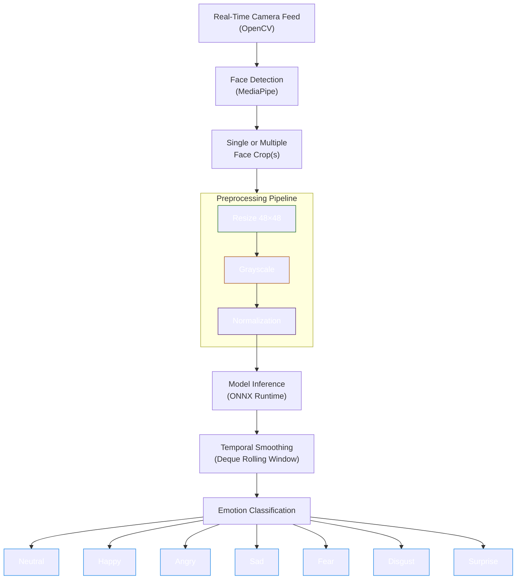

<div align="center">


# Real Time Facial Emotion Recognition


</div>

### Table of Contents

1. [About this Project](#about-this-project)
2. [App Visuals](#app-visuals)
3. [Installation and Usage](#installation-and-usage)
4. [Project's Structure](#projects-structure)
5. [Dataset Used](#dataset-used)
6. [Methodological Approach](#methodological-approach)
7. [General Informations](#general-informations)


## About this Project
This project is a complete real‑time Facial Emotion Recognition (FER) system built from scratch, combining computer vision, deep learning, and efficient model deployment. It detects faces in a live video stream, preprocesses them, and predicts the corresponding emotion using a custom CNN exported to ONNX for faster inference.

The goal is to provide a lightweight, responsive, and fully local FER pipeline that runs in real time on CPU, without requiring heavy GPU resources. This project is designed to be modular and deployable, making it suitable for prototyping, and showcasing end‑to‑end machine learning engineering skills and good coding practices.

The stack integrates:
* Python (3.10.6) as the programming language.
* MediaPipe for fast and reliable face detection.
* TensorFlow for the trained CNN architecture optimized for small grayscale inputs.
* ONNX Runtime for more efficient inference.
* OpenCV for the image anf video processing.
* Streamlit interface for easy an visualization and local demo.


## App Visuals



## Installation and Usage

#### 1. Repository clonning
```bash
mkdir ~/<your_path>/Real-Time-Facial-Emotion-Recognition && cd "$_"
git clone git@github.com:NkL-M/Real-Time-Facial-Emotion-Recognition.git
```

#### 2. Project navigation
```bash
cd Real-Time-Facial-Emotion-Recognition
```

#### 3. Virtual environment creation and activation

For Linux/MacOS:
```bash
python3.10 -m venv venv # Python 3.10.6 required
source venv/bin/activate
```

For Windows:
```bash
python3.10 -m venv venv # Python 3.10.6 required
venv\Scripts\activate
```

#### 4. Dependencies installation
```bash
make installation
```

#### 5. Run app demo
```bash
make app_demo
```
Once you want to stop the app demo, don't forget to press `Ctrl + C` in the terminal to quit the local demo and free
the local port.


## Project's Structure

```bash
.
│
├── emotion_recognition
│   ├── app/
│   │   ├── streamlit_app.py
│   │   └── video_capture.py
│   │
│   ├── face_detection/
│   │   ├── facial_detection.py
│   │   ├── inference.py
│   │   └── visuals.py
│   │
│   ├── interface/
│   │   ├── main.py
│   │   └── pipeline.py
│   │
│   ├── src/
│   │   ├── data.py
│   │   ├── model.py
│   │   └── registry.py
│   │
│   ├── params.py
│   └── utils.py
│
├── models_registry/
│   ├── saved_metrics/
│   ├── saved_models/
│   ├── saved_params/
│   └── saved_weights/
│
├── notebooks/
├── tests/
├── requirements.txt
└── setup.py
```

## Dataset Used
The dataset used for this project is [FER-2013](https://www.kaggle.com/datasets/msambare/fer2013), which for this project was downloaded from Kaggle. It is made of 35 887 grayscale images of faces, all in a 48x48 pixels format.

Split in 7 facial emotion classes:
- Neutral (6198 images)
- Happy (8989 images)
- Angry (4953 images)
- Sad (6077 images)
- Fear (5121 images)
- Disgust (547 images)
- Surprise (4002 images)

The dataset was split as followed:
- 22968 images for the training set
- 5741 images for the validation set
- 7178 images for the test set


## Methodological Approach

To do this project, I followed a pragmatic, end‑to‑end approach to build a real‑time
facial emotion recognition system that is fast, lightweight, and reliable.



### 1. Model Training
A custom CNN was trained using TensorFlow/Keras and Google Colab.
The architecture is intentionally lightweight to ensure real‑time inference
while maintaining good accuracy on small (48×48) grayscale face crops.


### 2. Face Detection
I chose Google's MediaPipe Face Detection solution to locate faces in each frame due to its speed,
robustness, and CPU performance.
Detected bounding boxes are converted to pixel coordinates for preprocessing.

### 3. Preprocessing Pipeline
Each detected face gets:
* cropped from the frame
* resized to 48×48 pixels
* converted to grayscale
* normalized to float32

This preprocessing ensures consistency with the training data.

### 4. ONNX Runtime Inference
The trained model was exported to ONNX using tf2onnx, for faster inference in deployment.
In average, exporting the TensorFlow model to ONNX allowed a 4 times speed-up in inference time
(TF = 30.56 ms, ONNX = 7.11 ms).

The detected faces are batched and passed through ONNX Runtime for efficient CPU inference.

The predictions are computed every N frames (3 in this case) to reduce compute
load while keeping the output responsive. This can be changed through the global variable
`FRAME_PRED_STRIDE` in `params.py`.


### 5. Temporal Smoothing
To further reduces flickering and improves readability, a rolling window is
applied to stabilize predictions over time.
Averaging probabilities across recent frames and allowing to always show a prediction
even in frames where inference isn't applied.

This feature is applied through the `PredictionSmoother` class.

### 6. Streamlit Demo Interface
The Streamlit app provides a simple interface to:
* capture webcam frames
* display detected faces
* overlay predicted emotions
* showcase real time performance


## General Informations

    Author : Nicolas Marechal
    Mail : marechal.n@hotmail.com
